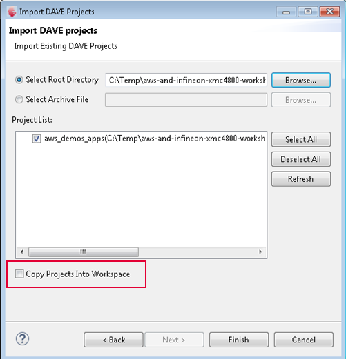
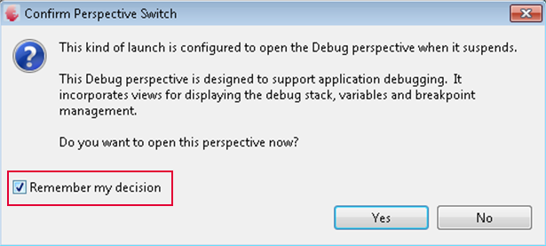

# Amazon FreeRTOS Workshop for the Infineon XMC4800 IoT Connectivity Kit
## Lab 1: Setup the Environment

> **Before you begin**: The Infineon development environment DAVE is available on the Windows 10 operating system.  This workshop has been tested on the Windows 10 operating system.

Lab 1 will organize the development environment prerequisites onto your workstation.  These tools are required to not only successfully complete the labs but set the foundation for developing solutions on AWS with the Infineon XMC4800 IoT Connectivity Kit.

In this lab, you will accomplish the following:

1. Create an AWS Account and prepare credentials.
2. Install required software.
3. Prepare AWS IoT Core configuration objects and artifacts.

**Approximate time to completion**: 50 minutes

### Create an AWS Account

This lab, and all other labs, require an AWS account. To create an AWS Account, follow the [instructions on the AWS website](https://aws.amazon.com/premiumsupport/knowledge-center/create-and-activate-aws-account/).

### Install Required Software

Note on the USB stick: on some Windows computers, you may be prohibited from running the installer from the USB drive.  If you get an error executing the installer, copy the installer to C:\Temp and then run it from C:\Temp.

The required software includes:

* git
* SEGGER
* Infineon DAVE™ - professional development platform for XMC microcontrollers

#### Git

Git software is required.

For Windows specifically, the labs require [Git for Windows](https://gitforwindows.org/).

When you install and setup Git, you will be able to clone repositories as well as perform ```diff``` and ```status``` operations in the local source tree that will help you understand what has changed in the source over time.

On Windows, install [Git for Windows](https://gitforwindows.org/), which includes the MINGW shell environment that integrates nicely with the Windows environment. This will enable you to use Python 2.7 from the command line within a UNIX-like environment, which will simplify working through the labs.

#### SEGGER J-Link Software and Documentation pack for Windows

Download and install the [J-Link Software and Documentation pack for Windows](https://www.segger.com/downloads/jlink/JLink_Windows.exe).  This software is required to start a debug (GDB) session.

#### DAVE™ - professional development platform for XMC microcontrollers


**NOTE** If you already have DAVE installed, ensure your IDE is completely up to date by checking for library updates via **Help** > **Check for DAVE APP Updates**.

Infineon DAVE4 is required to complete the labs.
1. Browse to [DAVE™ software download](https://infineoncommunity.com/dave-download_ID645)
2. Register and select the DAVE™ package you would like to download depending on your operating system
3. To install DAVE™, all you do is unpacking the downloaded zip file to a location of your choice (i.e. ```c:\DAVE4```).

   > **NOTE**: For Windows, a number of problems have been reported when people try to use Windows Explorer to unzip the zip file. Please use a third-party unzip program, such as 7-Zip

4. To simplify starting DAVE4 in the future, create a shortcut on your desktop to the DAVE.exe file in the eclipse folder.

### Initializing the Repository

In this section, you will learn the physical directory layout for Amazon FreeRTOS.  You will clone the git repository that include the Infineon DAVE projects and a reference to Amazon FreeRTOS as a git repository submodule.

From your Home directory, check out the sources.

1. Open the **Git Bash** shell on your workstation to perform work on the command line.
2. Clone the repository.  Make ```/c/src``` to ensure path lengths are short.
```
mkdir /c/src
cd /c/src
git clone --recursive https://github.com/rpcme/aws-and-infineon-xmc4800-workshop.git
```
3. In your HOME directory, you should now have directory ```aws-and-infineon-xmc4800-workshop```.

From this point onward, and throughout the remaining labs, the repository checkout directory is referred to as ```LAB_REPOPATH```.

> Alternatively, if you don't have git or you don't want to clone the repository (which is the best option, perform these steps:
>
> 1. Navigate to https://github.com/rpcme/aws-and-infineon-xmc4800-workshop.git.
> 2. Download the repository as ZIP.  Extract.  This will be known as ```LAB_REPOPATH```.

We will now check the DAVE4 installation. For this purpose, we will import the Amazon FreeRTOS Hello World Demo that serves as the baseline for all workshop labs.

1. Open DAVE4.  When you first open DAVE4, the IDE will prompt your for a workspace location. Choose the default location and check the box "don't ask again".
2. Import the project.
   1. Open the import dialog by clicking **File > Import...**.
   2. Expand **Infineon**, select **DAVE Project**, and click **Next**.

    

   3. For 	**Select search-directory**, choose **Browse...**
   4. Locate the directory ```LAB_REPOPATH```, and then navigate to ```LAB_REPOPATH/amazon-freertos/demos/infineon/xmc4800_iotkit/dave4_apps```.  Click Open.
   5. Ensure that **aws_demos** is checked in the **Discovered projects**.
   6. Ensure that the **Copy projects into workspace** checkbox is NOT checked.

      

   7. Click **Finish**.
3. Run a full compile by clicking **Project > Build Active Project** or the Build Active Project button in the menu bar.

   

At this point, the project builds but it is not configured properly for connectivity.  In the next section, we will configure the project to run the Hello World demo.

We will now try to run the unmodified ```aws_demos_apps``` project

1. Connect the XMC4800 development board to your computer by inserting the USB cable to the SEGGER OB and your computer.
5. Modify the SEGGER GDB server variables.
   1. In DAVE, click **Window > Preferences**.
   2. Under **Run/Debug**, click **String Substitution**.
   3. Check the value of ```jlink_path```.  If the path of the installed SEGGER tools differs, modify the ```jlink_path``` to the SEGGER GDB server utility.  Note that normally the version number needs modification, i.e. ```JLink_V634g``` => ```JLink_V640```.
   4. If modified, click **OK**.  Otherwise, click **Cancel**.
2. To flash and start debugging the demo, click the debug button in the menu bar.

    

3. If you get a dialog box to upgrade the on-board debugger firmware, click Update.

   

4. Double-click **GDB SEGGER J-Link Debugging** to create a new debug configuration.
   In the **Startup** tab enable semihosting

   


5. Click **Debug**
6. If it is the first time you lunch the debugger in the current workspace the followiing dialog will pop up. Check the **Remember my decision** checkbox and click **Yes**.

   

7. When the debug process starts, your debugging session will start and an automatic breakpoint will be added for the ```main()``` function.

8. Display the **Semihosting and SWV** console.

	

9. Click the **Resume** button in the DAVE4 Debug perspective menu bar.

    

10. The demo should now be running.  When completed, the output in the console will be similar to the following.

    > **Make a note of the MAC address for later usage**

    


You will configure the project with your WiFi settings and the certificates to connect to AWS IoT Core in the next lab.

#### Python

Python is required for running AWS IoT test scripts and using the AWS CLI.

On Windows, Python may not be installed on your system.

After Python installation, ensure that you install Pip and then the AWS CLI.

##### Python Installation

Install Python 2.7.

1. Download Python 2.7.  Download from [this page](https://www.python.org/downloads/) under **specific releases**.  As of this writing, the [latest is 2.7.15](https://www.python.org/downloads/release/python-2715/).  
2. Install Python 2.7 to the default path.
3. Ensure that ```python``` is in your ```PATH```.  On Windows, open a new Git Bash shell, and type ```which python``` and press enter.  The input and output should be similar to the following.

   ```bash
   $ which python
   /c/Python27/python
   ```

   If you get this result, move to the next section.

5. Add the python directory to your SYSTEM path.
    1. On Windows, open Advanced System Settings.
    2. In the lower-right hand corner, click the Environment Variables button.
    3. In the lower panel named **System Variables**, click **Edit...**.
    4. Add the Python Scripts path to your system variables by clicking **New** and then add the path, i.e. ```C:\Python27```.
    5. Click OK.
    6. Click OK.
6. Close the ```Git Bash``` window and then open again.  When issuing ```which python```, the path should show.


##### Pip Installation

1. If not already open, on Windows open the ***Git Bash*** shell.
2. Issue the following command to download the ```pip``` installer.

   ```bash
   curl https://bootstrap.pypa.io/get-pip.py -o get-pip.py
   ```

3. Issue the following command to install ```pip```.

   ```bash
   python get-pip.py
   ```
4. Issue the following command to see if pip is not in the path.

   ```bash
   $ which pip
   /c/Python27/Scripts/pip
   ```

   If you see this output, continue to the next section.
5. Add the scripts directory to your SYSTEM path.
   1. On Windows, open Advanced System Settings.
   2. In the lower-right hand corner, click the Environment Variables button.
   3. In the lower panel named **System Variables**, click **Edit...**.
   4. Add the Python Scripts path to your system variables by clicking **New** and then add the path, i.e. ```C:\Python27\Scripts```.
   5. Click OK.
   6. Click OK.
6. Close the ```Git Bash``` window and then open again.  When issuing ```which pip```, the path should show.

##### AWS CLI Installation and Configuration

Install the AWS CLI using ```pip```.

```bash
pip install awscli
```

Configure your credentials.

Run the following command to configure the AWS CLI.

```bash
aws configure
```

If you see output similar to the following, you can move to the next section since your AWS CLI configuration has already been configured.  You can press ```CTRL-C```.

```text
$ aws configure
AWS Access Key ID [****************UDXA]:
```

Otherwise you need to get AWS programmatic access credentials to configure the AWS CLI.

1. Login to the [AWS Console](https://console.aws.amazon.com/console/home).
2. Click Services > IAM.
3. Click Users.
4. Click Add user and enter user name of your choice.
5. Enable 'Programatic access' check box in Access type.
6. Click Next:Permissions button. Click Attach existing policies directly.
7. In the filter box enter iot.
8. Enable 'AWSIoTConfigAccess'
9. Click Next:Tags button.
9. Click Next:Review and finally click Create user button.
10. Download user security credentials file credentials.csv.

Now, enter ```aws configure``` once more. Open credentials.csv file and copy the Access Key, Secret Key, Region (eu-west-1), and format (json) when prompted.

> You can choose one of the available regions on the navigation bar of the [AWS Console](https://console.aws.amazon.com/console/home). For example if you choose ```Frankfurt``` as your region you will see that the URL changes to https://eu-central-1.console.aws.amazon.com/console/home?region=eu-central-1#. In this case the region to enter when asked by aws configure command would be ```eu-central-1```.

### Registering Your Device

Throughout these Labs, the primary interface for working with the AWS Cloud is the command line.

The dominant reason for using the CLI is that most customers will want to automate these processes.  Command line and/or SDK awareness is essential.

From time to time visual confirmation may be an effective way to correlate CLI functions to what would be seen in the AWS Console. In such case, you may wish to login to the AWS Console to evaluate what the components look like or how they are organized.  However, the Labs do not lead through the steps to evaluating those objects.

*Also*, some learners may want to simply copy-paste CLI commands and code.  Although not disallowed, **it is strongly encouraged learners type in CLI commands and code**.  Otherwise, learning oversights may occur in performing the configuration and coding.

#### Create the Thing Object

In this step, you will create the Thing object - a representation of your device in the AWS IoT Core Device Registry.

In the previous section, you acquired the MAC Address of the device.  The Thing Name will be the MAC Address, but the colons need to be removed.

1. Open the **Git Bash** shell.
2. Set the variable for the Thing name.  Time to use the MAC address you got when checking the DAVE4 installation. If your MAC Address is ```98:84:e3:f6:04:11```, then your Thing Name will be ```9884e3f60411```.
3. To create the virtual device, issue the following command from the  *terminal window*:

   ```bash
   THING_NAME=9884e3f60411
   aws iot create-thing --thing-name ${THING_NAME}
   ```

4. The command line emits the Thing's ARN, which looks similar to the following:

   ```json
   {
      "thingArn": "arn:aws:iot:[YOUR_REGION]:[YOUR_ACCOUNT_ID]:thing/[YOUR_MAC_ADDRESS]",
      "thingName": "[YOUR_MAC_ADDRESS]"
   }
   ```

#### *Optional*: Verifying Thing Creation in the AWS Console

1. Login to the AWS Console.
2. Select the Region that is defined in the AWS credential ```configuration``` file.
3. Click ```Services``` > ```IoT Core```.
4. Click the **Manage** menu item on the left hand side, and then click **Things**.
5. Manually identify that the Thing has been created.

#### Create the Device Certificate

In this step, you will create the certificates to authenticate your Thing with AWS IoT.  Although you can perform these steps using the AWS Console, customers will typically use the AWS CLI or API.

*WARNING*: When creating a new certificate with AWS IoT, the generated Public and Private keys can only be retrieved directly after creation.

When you authenticate with AWS IoT, the service receives the certificate and verifies that the certificate was signed with the private key to determine that the certificate is not falsified.

| File        | Purpose                                                            |
|-------------|--------------------------------------------------------------------|
| Private key | Used for signing the Certificate, represents your device identity. |
| Certificate | Authentication with AWS IoT (the Policy authorizes you)            |
| Public key  | Unused                                                             |
| Root CA     | AWS IoT endpoint verification                                      |


Using the Terminal Window, change directory to the certificate and key working directory.

```bash
cd ${LAB_REPOPATH}
mkdir credentials
cd credentials
```

Generate the client certificate and key.  This command is cross-platform.  The command will generate a lot of output.  There is one key output we require for future operation: the ```certificateArn``` property.  We can narrow the output using the ```--query``` flag.

> ```bash
> aws iot create-keys-and-certificate --set-as-active \
>     --certificate-pem-outfile    ${THING_NAME}_certificate.pem \
>     --public-key-outfile         ${THING_NAME}_public_key.pem  \
>     --private-key-outfile        ${THING_NAME}_private_key.pem \
>     --query certificateArn
> ```

At the top of the output, locate the ```certificateArn``` property. Copy the value, which has a pattern of ```arn:aws:iot:<region>:<accountId>:cert/<certificateId>```. You will use this value when you attach the Policy to the Certificate.  It will look similar to the following:

```json
{
    "certificateArn": "arn:aws:iot:eu-west-1:012345678910:cert/8530c605d209a17917da34e5516c452a782e1dddb4dcdadc6d4fb742504d146b",
...
}
```

For ease of use later in this module, you may wish to set this to an environment variable:

```bash
CERTIFICATE_ARN=arn:aws:iot:eu-west-1:012345678910:cert/8530c605d209a17917da34e5516c452a782e1dddb4dcdadc6d4fb742504d146b
```

#### Create the Gateway's Policy

In this step, you will setup a policy to grant appropriate permissions for your Thing when authenticating with the Certificate.

Create the policy file on the device.  To keep the files organized, create this file in the ```credentials``` directory.

```bash
cat >> ${THING_NAME}_policy.json << EOF
```

Enter the following AWS IoT policy.  This policy allows the authenticated Thing to perform any action on any MQTT topic.  It is convenient for development, but not appropriate for when your devices go into production.

```json
{
  "Version": "2012-10-17",
  "Statement": [{
    "Effect": "Allow",
    "Action":["iot:*"],
    "Resource": ["*"]
  }]
}
EOF
```

Set the Policy name.

```bash
POLICY_NAME=${THING_NAME}_Policy
```

Create the AWS IoT policy.

```bash
  aws iot create-policy                     \
          --policy-name ${POLICY_NAME}      \
          --policy-document file://${THING_NAME}_policy.json
```

#### Associate the Thing and Policy to Certificate

Associate the Thing and Policy with the Certificate.  Multiple Policies and Things can be attached to the Certificate, but this is typically considered an insecure configuration since multiple Things would connect with the same Client Certificate, and if the private  key becomes compromized /all Things would become compromised/.

Use the following command line to associate the Thing to the Certificate.


```bash
aws iot attach-thing-principal             \
        --thing-name $THING_NAME           \
        --principal $CERTIFICATE_ARN
```


Use the following command line to associate the Policy to the Certificate.

```bash
aws iot attach-principal-policy            \
        --policy-name $POLICY_NAME         \
        --principal $CERTIFICATE_ARN
```


At this point, when the client code makes a connection using the Client certificate, then it will be able to perform all AWS IoT actions.

### Outcomes

In this lab, you learned about the software needed to build solutions on top of AWS with the Infineon XMC4800 IoT Connectivity Kit.  Also, you learned about the AWS IoT Core objects needed to make a successful connection.

In the next lab, you will learn about how to make the connection successful using these objects and understand the basic Amazon FreeRTOS framework.  

[Next Lab](./Lab2.md)
