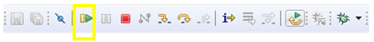

# Amazon FreeRTOS Workshop for the Infineon XMC4800 IoT Connectivity Kit
## Lab 3: Using AWS IoT Core


In this lab, you will learn how to organize code into a new Amazon FreeRTOS Task, use the internal die temperature sensor (DTS) of the Infineon XMC4800, ingest basic telemetry data, and then do something interesting with the data in the AWS Cloud. 

### Premise

Acquiring sensor data from the local environment, pushing it to the cloud, and then doing something interesting with the data is one of the most common underlying practices when developing IoT solutions.

The XMC™ Lib consists of low level drivers which contain APIs for the XMC™ product family peripherals. The System Control Unit (SCU) driver library is a part of the XMC™ Lib which groups functions for controlling the General Control Unit including temperature monitoring, Clock Control Unit, Reset Control Unit and Interrupt System. You will use the DTS driver to read the internal temperature sensor. 

Finally, we will do something interesting with the data by taking the data and pushing it to AWS IoT Analytics.  In this lab we will use AWS IoT Analytics to store data so it can be easily displayed by your visualization of choice.  We will demonstrate how to get large datasets from AWS IoT Analytics.

### Remove the Echo Demo Task

In this section, we will remove the ```xCreateTask``` call for the original Echo task that came with the demonstration.

1. Using DAVE4, navigate the cursor to the ```void vStartMQTTEchoDemo( void )``` function.
2. Scroll to the end of the function.  You will notice the ```xCreateTask``` call that starts the Echo demo.  It looks like the following.

   ```c
        ( void ) xTaskCreate( prvMQTTConnectAndPublishTask,        /* The function that implements the demo task. */
                              "MQTTEcho",                          /* The name to assign to the task being created. */
                              democonfigMQTT_ECHO_TASK_STACK_SIZE, /* The size, in WORDS (not bytes), of the stack to allocate for the task being created. */
                              NULL,                                /* The task parameter is not being used. */
                              democonfigMQTT_ECHO_TASK_PRIORITY,   /* The priority at which the task being created will run. */
                              NULL );                              /* Not storing the task's handle. */
   ```
3. Select the xTaskCreate call, and click delete.

### The Temperature Task

1. Scroll to the bottom of ```aws_hello_world.c```.  Your cursor should be beneath the function you implemented in Lab 2: ```prvMacForHumans```.
2. Add the ```#define```s used for this task.  Normally, this would go into a header file, but we do it here to keep the implementation simple.

   ```c
   #define TEMPERATURE_TASK_READ_DELAY_MS  3000
   ```

3. Implement the ```prvTempSensorReaderTask```.  We will walk through this step by step.

   Here, we are making some local declarations.
   ```c
   static void prvTempSensorReaderTask( void * pvParameters )
   {
	    char cDataBuffer[ 64 ];
	    xMQTTTaskParameter *pxParameters;
	    pxParameters = ( xMQTTTaskParameter * ) pvParameters;
	
	    float           temperatureC;

        XMC_SCU_EnableTemperatureSensor();
        XMC_SCU_CalibrateTemperatureSensor(0, 0);

   ```

	Here, we start the temperature meaurement conversion and configure a delay to roughly define the interval at which to do the temperature reading, which is *at least* every three seconds.
	
	```c
	    while (1) {
            XMC_SCU_StartTemperatureMeasurement();
	        vTaskDelay( pdMS_TO_TICKS( TEMPERATURE_TASK_READ_DELAY_MS ) );
	```
	Sometimes, you may be initializing the MQTT handle in another task that may have not had the chance to initialize the handle yet. In this case, we go back to top and to the vTaskDelay again.
	
	```c
            if ( xMQTTHandle == NULL ) continue;
	```
	
   Here, we read the result of temperature conversion and calculate the actual temperature in Celsius and Fahrenheit degrees.
   
   ```c	
            temperatureC = (XMC_SCU_GetTemperatureMeasurement() - 605) / 2.05F;
	
            configPRINTF(("Celsius: %f\r\n", temperatureC));
   ```
   
   Now that we have the data, we can send it to the cloud.  We want to send the data in JSON format.  Also, we want the message to contain our Device ID so when the data gets logged somewhere, it can keep a record of where it came from.  As you can see, we are using the familiar ```thing_mac_address``` again.
   
   ```c	
	        snprintf(cDataBuffer, sizeof( cDataBuffer), "{\"temperature\":%f, \"d\":\"%s\"}", temperatureC, thing_mac_address);
	```
	Next, we simply organize the parameters to publish using the already initialized MQTT Agent.
	
	```c
	        MQTTAgentPublishParams_t pxPublishParams;
	        pxPublishParams.pucTopic = ( uint8_t * ) pxParameters->topic;
	        pxPublishParams.usTopicLength = ( uint16_t )  strlen(( const char * )pxParameters->topic);
	        pxPublishParams.pvData = cDataBuffer;
	        pxPublishParams.ulDataLength = ( uint32_t )  strlen(( const char * )cDataBuffer);
	        pxPublishParams.xQoS =  eMQTTQoS1;
	
	        if ( MQTT_AGENT_Publish(xMQTTHandle, &( pxPublishParams ),
	                democonfigMQTT_TIMEOUT) == eMQTTAgentSuccess )
	        {
	            configPRINTF(("Outbound sent successfully.\r\n"));
	        }
	        else
	        {
	            configPRINTF(("Outbound NOT sent successfully.\r\n"));
	        }
	
	    }
	}
   ```
4. Add the function declaration. This can be placed below the function declaration for ```prvMacForHumans```.
   
   ```c
   static void prvTempSensorReaderTask( void * pvParameters );
   ```

5. Add the structure definitions.  There are two structures that need to be defined. One is for the Task parameter and the other is for managing sensor data.  

   ```c
   
	typedef struct Temperature_Reading
	{
	    float           reading;
	} xTemperatureReading;
	
	typedef struct MQTT_Task_Parameter
	{
	    char * thingName;
	    char   topic[128];
	} xMQTTTaskParameter;


   ```

6. Move the Broker Connection function call by pulling it out of the demo task and up one - which is effectively in the runnable context of the scheduler initialization hook.  This will setup the global MQTT connection handle for multiple tasks.
   1. In the function ```static void prvMQTTConnectAndPublishTask( void * pvParameters )```, locate the following lines.

      ```c
          /* Create the MQTT client object and connect it to the MQTT broker. */
          xReturned = prvCreateClientAndConnectToBroker();
      ```
   2. **Cut** those two lines, and paste them into the ```void vStartMQTTEchoDemo( void )``` function, directly beneath the ```prvMacForHumans(thing_mac_address);``` function call.  The code should look like the following.

      ```c
         ...
         
         prvMacForHumans(thing_mac_address);

         /* Create the MQTT client object and connect it to the MQTT broker. */
         xReturned = prvCreateClientAndConnectToBroker();
         
         ...
      ```
   3. At the beginning of the same function, add the declaration for ```xReturned``` beneath the ```configPRINTF``` call.  The resulting code will look like the following.
   
      ```c
          configPRINTF( ( "Creating MQTT Echo Task...\r\n" ) );
          BaseType_t xReturned;
      ```	
7. Add the temperature task ```xCreateTask``` call to the ```void vStartMQTTEchoDemo( void )``` function.  As you might recall, in the temperature task we relied on task parameters to pass along the topic name for publishing the JSON payload to the AWS Cloud.
   
   Declare the property structure beneath the ```xReturned``` declaration.
   
   ```c
       void vStartMQTTEchoDemo( void )
       {
           configPRINTF( ( "Creating MQTT Echo Task...\r\n" ) );
           BaseType_t xReturned;
           xMQTTTaskParameter taskParameter_temperature;
    
           ...
   ```
   
    Move the cursor back to the ```void vStartMQTTEchoDemo( void )``` function.  Beneath the configASSERT statement, add the following code.

   ```c
        if ( xReturned == pdPASS )
        {
            memset( taskParameter_temperature.topic, 0x00, sizeof( taskParameter_temperature.topic ) );
            snprintf( taskParameter_temperature.topic, sizeof( taskParameter_temperature.topic ), "temperature/%s", thing_mac_address );

            xReturned = xTaskCreate( prvTempSensorReaderTask,
                                     "DTS",
                                     TEMP_TASK_STACK_SIZE,
                                     ( void * ) &taskParameter_temperature,
                                     TEMP_TASK_PRIORITY,
                                     NULL );
        }
    ```
    
    As you can see, we are first zeroing out the memory for the topic name, and then adding the topic destination.  You can also see we are again leveraging the MAC address.  Organizing the data this way enables us to do more clean AWS IoT Core rules definitions.
    
    Also, you can see that the task is using a couple of declares - ```TEMP_TASK_STACK_SIZE``` and ```TEMP_TASK_PRIORITY```.  The ```TEMP_TASK_STACK_SIZE``` is a multiplier of the minimum stack size declaration in FreeRTOSConfig.h.  The ```TEMP_TASK_PRIORITY``` is a relative value to other tasks running in the system so the scheduler can determine relative priority.  In our case, we will use the default which is to use the same priority as the idle task.

   Place the declares after the xMQTTHandle declaration around line 185.
   
   ```c
   ...
   
   static MQTTAgentHandle_t xMQTTHandle = NULL;

   #define TEMP_TASK_STACK_SIZE                ( configMINIMAL_STACK_SIZE * 7 )
   #define TEMP_TASK_PRIORITY                  ( tskIDLE_PRIORITY )
   
   ...
   ```    
    
### Test the Temperature Task

At this point, the Temperature task has been implemented and is ready to run.

1. Open the AWS Console.
2. From the menu bar, click on Services > IoT Core.
3. On the lower left hand side, click Test.
4. For the subscription topic, enter ```#``` and click Subscribe.
5. Since the sensore data is using floating point and the printf support for floating point is by default disabled, you will need to enable it in the Project properties
    
    

6. In DAVE4, rebuild the project by clicking **Project > Build Active Project** or **Build Active Project** button in menu bar.

    

7. To flash and start debugging the demo click the debug button in the menu bar.

    

8. Click the **Resume** button in the DAVE4 Debug perspective menu bar after the cursor runs to the ```main()``` breakpoint.

    

9. View the output in the IoT Console.

### Capture and Prepare to Display Analytics

In this section, you will learn how to simply capture and display telemetry data for dashboarding.  Although this process does not display graphical results in near-real-time, what it does do is help you understand how to organize your data for better long term analytical persuits -- a means to help answer the question of what kinds of problems you can solve with IoT data.

AWS IoT Analytics is all about capture-act-store, where you setup a channel to ingest data, setup actions to clean up or enhance data, and then store data in an AWS IoT Analytics managed repository.

#### Setup CloudWatch Logging

From the AWS Console, in the menu bar at the top, click **Services**. In the filter box, type Analytics. The first option should be IoT Analytics.  Click it.

In case we face errors, it's always good to have logging enabled.

1. In the lower left-hand corner, click **Settings**.
2. In the main content panel, click the **Edit** button.
3. From the drop-down list, select **Error**.
4. In the **Set Role** configuration area, click **Create new**.
5. For the **name**, enter **iot-analytics-cloudwatch-role**.  Click the **Create role** button.
6. Click the **Update** button.

#### Setting up the AWS IoT Analytics Channel

Next, we need to setup the analytics ingest point.

1. Click the AWS IoT Analytics icon in the upper-left of the console.
2. A panel should appear in the content panel for collecting messages.  Click the **Create a channel** button.
3. For the Channel ID, enter **myTemperatureCollector**. 
4. Click the Next button.
5. In the IoT Core topic filter, enter the following.

   ```text
   temperature/#
   ```
6. For the IAM role name, click the **Create new** button.
7. For the Name value, enter **iot-analytics-action-role**.
8. Click the **Create role** button.
9. Click the Create Channel button.

#### Setting up the AWS IoT Analytics Pipeline

In this section, we create a Pipeline (without any actions) to connect the ingest channel to the data store.

1. On the left hand side, click Prepare and then Pipelines. Click the button to begin creating a new pipeline.
2. For the **Pipeline ID**, enter **myTemperaturePipeline**.
3. For the **Pipeline source**, select **mytemperaturecollector**.
4. Click **Next**.
5. Set the temperature, timestamp, and d (device id) attributes.  In a later section, we will learn how to add a timestamp attribute to the payload.  From the previous sections, you know that we are sending only temperature and device identifier.

	**ADD IMAGE HERE**
6. Click Next
7. Click Next
8. For **Pipeline output**, click the link **Create new data store**.
9. For the data store, enter **myTemperatureStore**.
10. Click the 	**Create data store** button.
11. Click the **Create pipeline** button.


#### Editing the IoT Rule to get Timestamp

In order to get time based analytics, we need to add the timestamp to the payload.

Although this isn't extremely scientific since it isn't the exact time the reading was taken, it does give you an idea on how to cheaply enrich data from legacy systems on the fly.

When we created a channel, a Rule was create in AWS IoT Analytics.  We will slightly modify this rule.

1. Open the AWS IoT Core Console.
2. On the left-hand side, click Act.
3. Find the rule named ```IoTAnalytics_myTemperatureCollector```.  Click it.
4. In the subheading **Rule query statement**, on the right-hand side, there is an **Edit** link.  Click the Edit link.
5. Under the Attribute section, ensure the following is set:

   ```sql
   *, timestamp() as timestamp
   ```
   What we are doing here is running a Rules Engine builtin to insert the value on the fly.
6. Click the Update button.

#### Creating the Data Set

The data set defines a SQL query for accessing the data in the data store.

1. In the AWS IoT Analytics console, on the left hand side, click Analyze and then **Data sets**.
2. In the content panel, click the **Create a data set** button.
3. Click the **Create SQL** button.
4. For id, enter mytemperaturedataset.
5. For Select data store source, select mytemperaturestore.
6. Click Next.
7. For **Author SQL Query**, enter the following query. It creates a dataset for a specific sensor.

   ```sql
   SELECT temperature, timestamp FROM mytemperaturestore WHERE d = '[YOUR_MAC_ADDRESS]'
   ```
   
   Replace [YOUR_MAC_ADDRESS] with the MAC address on your board.  For example:
   
   ```sql
   SELECT temperature, timestamp FROM mytemperaturestore WHERE d = '9884e3f60411'
   ```
   
   Click Next.
8. Set the **Data selection window** to **None**.  Click Next.
9. For Set query schedule (optional) set the Frequency to **Not scheduled**. Click **Next**.
10. For Configure the results of your analytics, Retain data set content == Indefinitely
11. Click the **Create data set** button.  Clicking the button does not automatically run the dataset.  You have to either manually run it or set it to a schedule.
12. In the datasets window, click mytemperaturedataset
12. Under the **Actions** drop-down, click **Run now**.

After some time, the data set will be constructed.  It may take five minutes or more.

#### Viewing the dataset

After the dataset is constructed, you can download it as a CSV File.  The data is also available through the AWS API.

To view the dataset, perform the following.

1. In the datasets window, click **mytemperaturedataset**.
2. On the left hand side, click **CSV**.
3. For the particular run, click Download.  If there is nothing to download yet, and you are sure that you have performed the **Run now** function in the previous section, wait a couple minutes and then refresh.  The initial dataset could still be generating.

You can now view the run data in Excel or other text editing tool.

### Outcomes

In this lab, you learned how to implement a new Task in Amazon FreeRTOS, send telemetry data to the AWS Cloud, and report on that data.

Next, learn about how to work with the Device Shadow.

[Next Lab](./Lab4.md)
